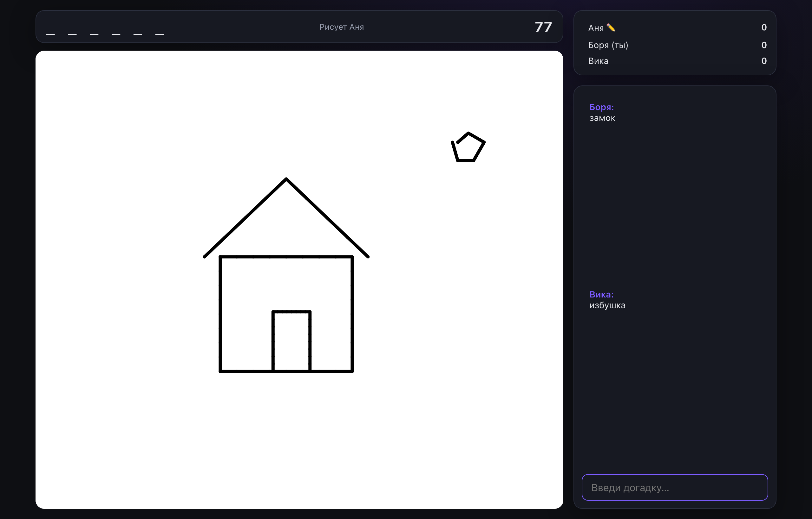
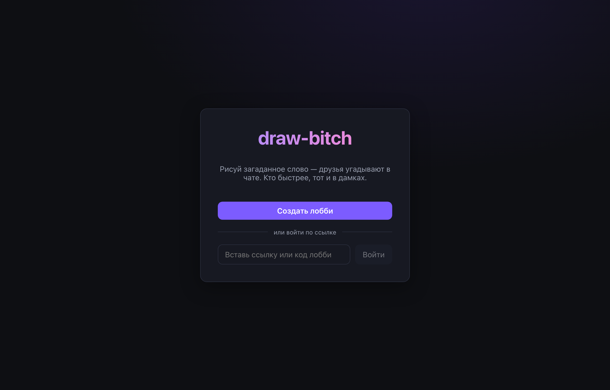
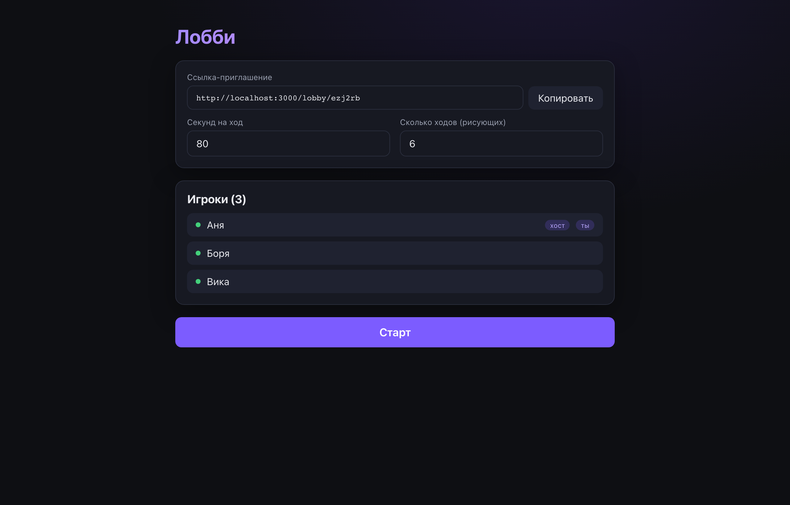
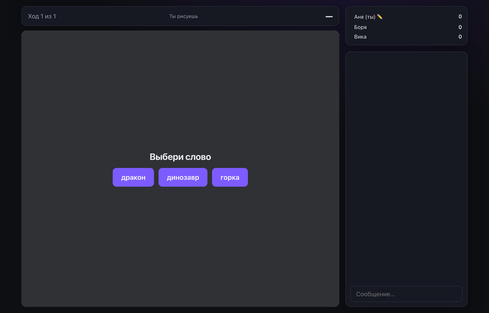
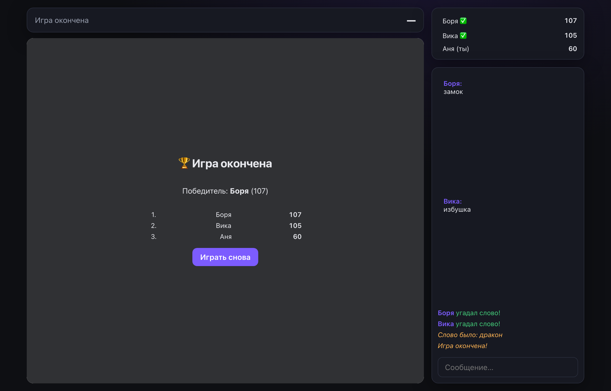
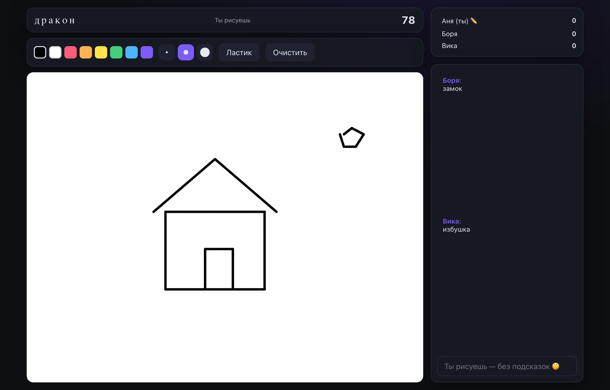

<div align="center">

# 🎨 draw-bitch

**Рисуй загаданное слово — друзья угадывают в чате. Кто быстрее, тот и в дамках.**

Минималистичная реалтайм-игра в духе Skribbl для компании друзей.
Хост создаёт лобби, кидает ссылку — и поехали.

</div>

<div align="center">
  
</div>

---

## ✨ Возможности

- 🔗 **Лобби по ссылке** — хост создаёт комнату, задаёт секунды на ход и число ходов, делится ссылкой.
- 👥 **Без регистрации** — заходишь, вводишь имя, играешь.
- 🎨 **Рисование в реальном времени** — холст, 8 цветов, 3 размера кисти, ластик, очистка. Штрихи летят всем мгновенно по WebSocket.
- 💬 **Угадайка в чате** — пишешь догадку; угадал — очки начисляются, слово не палится остальным.
- ⚡ **Очки за скорость** — чем быстрее угадал, тем больше очков; рисующий получает бонус за каждого угадавшего.
- 🔄 **Авто-переподключение** — закрыл вкладку или потерял связь? Возвращаешься по той же ссылке со своими очками.
- 👑 **Передача хоста** — если хост ушёл, роль переходит следующему.

## 🛠 Стек

| Слой | Технологии |
|------|-----------|
| **Бэкенд** | Python 3.13, FastAPI, WebSocket, [uv](https://github.com/astral-sh/uv). Состояние игры — в памяти, без БД. |
| **Фронтенд** | Next.js 15 (standalone), React 19, TypeScript, HTML5 Canvas. |
| **Инфра** | Docker, GitHub Actions → GHCR, nginx + TLS, авто-деплой по cron. |

---

## 📸 Как это выглядит

|  |  |
|:--:|:--:|
| **Главная** — создать лобби или войти по ссылке | **Зал ожидания** — игроки, настройки, приглашение |
|  |  |
| **Выбор слова** — рисующему дают 3 на выбор | **Финал** — итоговая таблица и «играть снова» |
|  |  |

**Рисующий видит слово и инструменты, угадывающие — только маску:**

<div align="center">
  
</div>

## 🎮 Как играть

1. Открой приложение и нажми **«Создать лобби»**.
2. Скопируй ссылку-приглашение и скинь друзьям (нужно ≥2 игроков).
3. Все вводят имена; хост задаёт секунды на ход и число ходов и жмёт **«Старт»**.
4. Игроки **по очереди рисуют** загаданное слово, остальные **угадывают в чате**.
5. После заданного числа ходов — **итоговая таблица**, и лобби снова готово к новой игре.

## 🚀 Локальный запуск

Нужны [`uv`](https://github.com/astral-sh/uv) и `node 22+`.

```bash
# 1) бэкенд → http://localhost:8000
cd backend && uv sync && uv run uvicorn app.main:app --reload

# 2) фронтенд → http://localhost:3000  (в другом терминале)
cd frontend && npm install && npm run dev
```

Открой http://localhost:3000, создай лобби, открой ссылку во второй вкладке/на телефоне,
введите имена и нажмите «Старт».

Либо весь стек в Docker:

```bash
make dev        # docker compose up --build
```

## ✅ Проверки

```bash
make check                                  # бэкенд: ruff + mypy + pytest (покрытие ≥85%)
cd frontend && npm run typecheck && npm run build
```

## 📦 Деплой и CI/CD

`git push` в `master` запускает GitHub Actions: тесты → сборка образов
`drawbitch-backend` и `drawbitch-frontend` → публикация в GHCR.

На сервере (один раз):

1. Положить `docker-compose.prod.yml` и `deploy/` (например, `git clone`).
2. Заменить домен `drawbitch.duckdns.org` на свой в `docker-compose.prod.yml` (CORS) и
   `deploy/nginx/draw-bitch.conf`; владельца образов (`troyan-dy`) — на свой GitHub.
3. Подключить `deploy/nginx/draw-bitch.conf` к общему nginx и выпустить TLS-сертификат
   (Let's Encrypt webroot → `/var/www/certbot`).
4. Добавить cron на `deploy/auto-update.sh`: тянет свежие образы из GHCR и пересоздаёт
   контейнеры при изменении.

```bash
# первый старт на сервере
docker compose -f docker-compose.prod.yml pull
docker compose -f docker-compose.prod.yml up -d
```

### HTTPS (Let's Encrypt, webroot)

```bash
certbot certonly --webroot -w /var/www/certbot -d drawbitch.duckdns.org
```

## 📝 Особенности

- Состояние игры **эфемерно** (в памяти бэкенда): перезапуск/деплой обрывает активные
  игры — для вечеринок это приемлемо, БД не нужна.
- WebSocket идёт через тот же домен: nginx роутит `/ws` и `/api` на бэкенд, остальное —
  на фронтенд. Бэкенд наружу закрыт (только loopback).
- Архитектура и устройство игры подробно описаны в [CLAUDE.md](CLAUDE.md).
